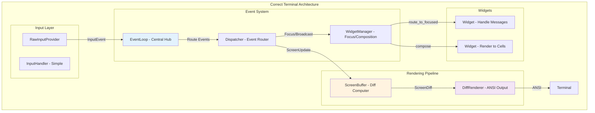

# Terminal Library Analysis Summary

## Architecture Understanding

After examining the terminal library thoroughly, I now understand how each component works together and why you experienced the issues with your clarity2 integration.

## Current Architecture (How It Actually Works)



## Problems with Your Clarity2 Integration

### 1. **Input Handling Issues** ❌
**Problem**: You were not using the proper input system
- ✅ **Correct**: Use `RawInputProvider` or `TerminalApplication`
- ❌ **Your approach**: Manual `InputHandler` without event loop
- ❌ **Result**: No input registration, blocking operations

### 2. **Flickering Issues** ❌
**Problem**: You were bypassing the diff renderer
- ✅ **Correct**: Use `EventLoop` with `ScreenBuffer` → `DiffRenderer`
- ❌ **Your approach**: Manual rendering with `terminal.render`
- ❌ **Result**: Full screen redraws, constant flickering

### 3. **Architecture Mismatch** ❌
**Problem**: You used DSL instead of the proper actor system
- ✅ **Correct**: `TerminalApplication(T)` with `EventLoop`
- ❌ **Your approach**: `ConvenientDSL` with manual rendering
- ❌ **Result**: Missing all the architectural benefits

## How You Should Have Integrated

### Option 1: Use TerminalApplication (Recommended)

```crystal
# Create widgets that handle messages properly
class ChatWidget
  include Terminal::Widget

  def initialize(@id : String)
    @messages = [] of String
  end

  def handle(msg : Terminal::Msg::Any)
    case msg
    when Terminal::Msg::InputEvent
      # Handle user input
      @messages << "User: #{msg.char}"
    end
  end

  def render(width : Int32, height : Int32) : Array(Array(Terminal::Cell))
    # Render messages to cells
    content = @messages.join("\n")
    Terminal::TextMeasurement.text_to_cells(content, width, height)
  end
end

# Proper application setup
widgets = [
  ChatWidget.new("chat"),
  Terminal::InputWidget.new("input", "> ")
]

widget_manager = Terminal::WidgetManager(Terminal::Widget).new(widgets)

app = Terminal::TerminalApplication(Terminal::Widget).new(
  widget_manager: widget_manager,
  input_provider: Terminal::InputProvider.default  # Uses RawInputProvider
)

app.start  # This handles everything automatically:
          # - Raw input mode
          # - Event loop
          # - Diff rendering
          # - No flickering
          # - Proper input handling
```

### Option 2: Use EventLoop Directly (Advanced)

```crystal
# Manual event loop setup (if you need more control)
input_provider = Terminal::InputProvider.default
dispatcher = Terminal::Dispatcher(Terminal::Widget).new(widget_manager, 80, 24)
screen_buffer = Terminal::ScreenBuffer.new
diff_renderer = Terminal::DiffRenderer.new(STDOUT)
cursor_manager = Terminal::CursorManager.new(STDOUT)

event_loop = Terminal::EventLoop(Terminal::Widget).new(
  input_provider,
  dispatcher,
  screen_buffer,
  diff_renderer,
  widget_manager,
  cursor_manager
)

event_loop.start  # Runs the full actor system
```

## Why the DSL Approach Failed

The `ConvenientDSL` and `ChatInterfaceDSL` are **presentation layer helpers**, not the core architecture:

1. **DSL Purpose**: Create widget layouts and content easily
2. **DSL Limitation**: Does NOT handle input, events, or proper rendering
3. **Your Usage**: You tried to use DSL as the main application architecture
4. **Result**: Bypassed all the sophisticated actor system benefits

## Key Architectural Insights

### 1. **Message-Driven Architecture** ✅
- Everything communicates via immutable messages
- Components run in separate fibers
- No shared mutable state
- Perfect for testing and reliability

### 2. **Diff-Based Rendering** ✅
- `ScreenBuffer` computes what changed
- `DiffRenderer` only outputs changed lines
- Eliminates flickering automatically
- Optimal performance over SSH

### 3. **Platform Input Abstraction** ✅
- `RawInputProvider` handles Unix/Windows differences
- Non-blocking input via termios/Win32 APIs
- Bracketed paste detection
- Proper terminal state management

### 4. **Widget Composition System** ✅
- Widgets handle messages and render to cells
- `WidgetManager` handles focus and composition
- Type-safe with generics `TerminalApplication(T)`
- Easy to test in isolation

## Correct Integration for Clarity2

Here's how you should integrate the terminal library:

```crystal
# File: src/clarity/agent2/cli/terminal_chat_interface.cr

class TerminalChatInterface
  def initialize(@app : App)
    @chat_widget = ChatWidget.new("chat")
    @input_widget = Terminal::InputWidget.new("input", "You: ")
    @status_widget = StatusWidget.new("status")

    setup_input_handling
  end

  def start
    widgets = [@chat_widget, @input_widget, @status_widget]
    widget_manager = Terminal::WidgetManager(Terminal::Widget).new(widgets)

    terminal_app = Terminal::TerminalApplication(Terminal::Widget).new(
      widget_manager: widget_manager,
      input_provider: Terminal::InputProvider.default
    )

    terminal_app.start  # This handles everything properly!
  end

  private def setup_input_handling
    @input_widget.on_submit do |text|
      handle_user_message(text)
    end
  end
end
```

## DSL Enhancement Path Forward

Now that we understand the architecture, we can enhance the DSL properly:

### Phase 1: Smart DSL That Uses Proper Architecture
```crystal
Terminal.chat_application do |app|
  app.widgets do |w|
    w.chat_area("messages") { |c| c.auto_scroll = true }
    w.input_area("input") { |i| i.prompt = "You: " }
  end

  app.on_user_input { |text| process_message(text) }

  app.run  # Uses TerminalApplication internally!
end
```

### Phase 2: Integration Helpers
```crystal
# Helper that properly integrates with existing architectures
class Clarity::TerminalInterface
  include Terminal::ApplicationIntegration

  def self.create_for(app : App)
    terminal_interface = new(app)
    terminal_interface.setup_widgets
    terminal_interface.start_event_loop
    terminal_interface
  end
end
```

## Lessons Learned

1. **Don't bypass the architecture** - The actor system exists for good reasons
2. **Use the diff renderer** - Manual rendering always flickers
3. **Understand the input flow** - Raw input → Events → Widgets → Rendering
4. **DSL is sugar, not architecture** - Use it on top of the proper foundation
5. **Test with the real system** - Don't mock what you don't understand

## Next Steps

1. **Fix Clarity2 Integration**: Use `TerminalApplication` properly
2. **Enhance DSL**: Build on top of the solid architecture
3. **Add Convenience Methods**: Make the architecture easier to use
4. **Create Examples**: Show proper integration patterns
5. **Update Documentation**: Clarify DSL vs Architecture roles

The terminal library is actually **extremely well designed** - we just need to use it correctly! 🎯